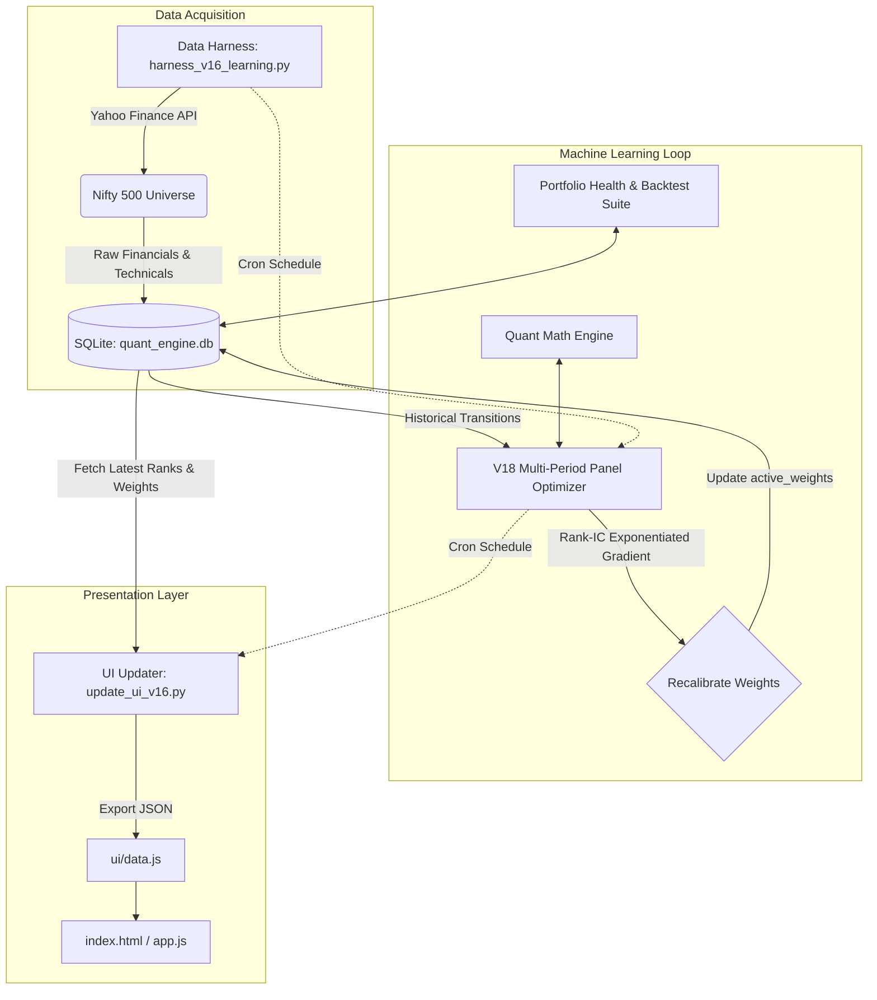

# 🚀 Multi-Bagger Stocks ML Train Loop & Quant UI


An institutional-grade Quantitative Machine Learning engine designed to evaluate, rank, and track Nifty 500 stocks. The system automatically pulls fundamental and technical data, predicts forward returns based on dynamic factor weights, and runs an out-of-sample gradient-descent optimizer loop across historical market regimes to self-correct its predictions.

The output is presented in a modern, glassmorphism-style web dashboard complete with an "AI Factor Breakdown" and raw quantitative metrics.

---

## 🤖 Claude Code & AI Agent Ready
This repository is configured for immediate use with **Claude Code** and other AI agents. See [CLAUDE.md](CLAUDE.md) for architectural invariants, development conventions, database schemas, and CLI workflows.

---

## 🏗️ Architecture

The system is broken down into three distinct layers: **Data Acquisition (Harness)**, **Machine Learning (Optimizer)**, and **Presentation (UI)**.



---

## 🧩 Core Components

### 1. The Data Harness (`harness_v16_learning.py`)
Fetches fundamental and technical data (P/E Ratios, ROCE, FCF Yield, SMA 50/200, Institutional Holdings) for all stocks in the Nifty 500. It rate-throttles requests (0.5s) to protect against API blocks and inserts clean snapshot records into SQLite.

### 2. The Quant Math Engine (`quant_math.py`)
Houses proprietary scoring and valuation algorithms:
- **Growth** (Compound revenue, EBIT, FCF, EPS growth)
- **Quality** (ROCE, FCF conversion ratio)
- **Valuation** (DCF intrinsic value with growth caps, Bank Justified P/B model, Margin of Safety)
- **Risk** (Strategic & disruption risk scoring)
- **Smart Money** (Institutional holding levels and historical delta)
- **Momentum** (Golden Cross vs Death Cross hard-kill protection)

### 3. The ML Optimizer (`weight_optimizer.py`)
The self-learning brain of the system. It discovers all historical snapshot dates, evaluates distinct forward-holding regimes (e.g. 27-day, 34-day, 20-day horizons), calculates cross-sectional Spearman Rank ICs, and performs continuous Exponentiated Gradient Descent on factor weights within bounded constraints (`[5.0%, 30.0%]`).

### 4. The Quantitative Verification Suite (`eval_portfolio_health.py`)
Verifies mathematical bounds, momentum hard-kill rules, factor non-degeneracy, active weight constraints, and conducts multi-period walk-forward quintile performance audits.

### 5. The Presentation Layer (`ui/` & `update_ui_v16.py`)
`update_ui_v16.py` extracts the latest predictions, active weights, and turnaround screen candidates into `ui/data.js`. The frontend (`index.html`, `app.js`, `style.css`) renders a browser-native, zero-dependency dashboard.

---

## 🚀 Getting Started

### Prerequisites
- Python 3.10+
- A modern web browser

### Installation
1. Clone the repository:
   ```bash
   git clone https://github.com/saurabnigam/multi-bagger-stocks-ml-train-loop.git
   cd multi-bagger-stocks-ml-train-loop
   ```
2. Set up virtual environment and install dependencies:
   ```bash
   python3 -m venv venv
   source venv/bin/activate
   pip install -r requirements.txt
   ```

3. Run the complete pipeline:
   ```bash
   python harness_v16_learning.py
   python weight_optimizer.py
   python update_ui_v16.py
   python eval_portfolio_health.py
   ```

4. View the Dashboard:
   Open `ui/index.html` in your web browser.

---

## 🧪 Testing & Verification
```bash
# Run unit tests for quantitative math
pytest test_quant_math.py

# Run portfolio health evaluation
python eval_portfolio_health.py
```

---

## ⚙️ Automation (The "Train Loop")

The system is designed to be autonomous. A cron job (`daily_cron.sh`) can be scheduled to run the entire pipeline on market days:
1. **Pull Data:** Collects market closing data.
2. **Train/Optimize:** Evaluates out-of-sample forward returns across historical transitions.
3. **Re-weight:** Adjusts factor weights via continuous gradient ascent.
4. **Publish:** Updates the dashboard data and commits to Git.
