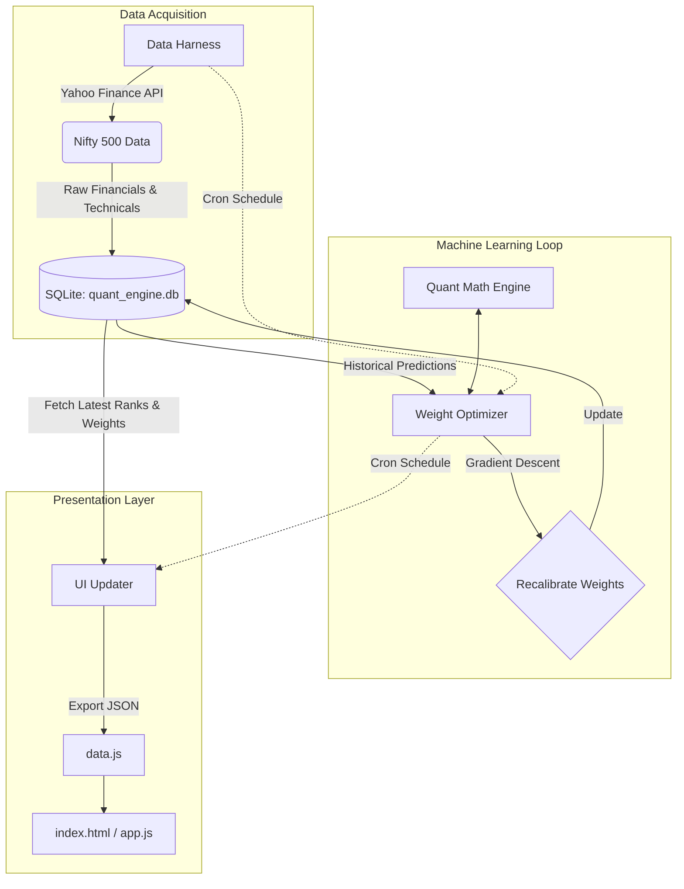

# 🚀 Multi-Bagger Stocks ML Train Loop & Quant UI


An end-to-end Quantitative Machine Learning engine designed to evaluate, rank, and track Nifty 500 stocks. The system automatically pulls fundamental and technical data, predicts forward returns based on dynamic factor weights, and runs a gradient-descent optimizer loop against historical data to self-correct its predictions.

The output is presented in a modern, glassmorphism-style web dashboard complete with an "AI Factor Breakdown" and raw quantitative metrics.

---

## 🏗️ Architecture

The system is broken down into three distinct layers: **Data Acquisition (Harness)**, **Machine Learning (Optimizer)**, and **Presentation (UI)**.



---

## 🧩 Core Components

### 1. The Data Harness (`harness_v16_learning.py`)
The data pipeline responsible for fetching fundamental and technical data (P/E Ratios, ROCE, FCF Yield, SMA 50/200, Institutional Holdings) for all stocks in the Nifty 500. It cleans the data and inserts raw financial metrics and initial predictions into the SQLite database.

### 2. The Quant Math Engine (`quant_math.py`)
Houses the core proprietary algorithms for scoring stocks. It calculates individual scores for:
- **Growth** (Earnings & Cash Flow momentum)
- **Quality** (Margins & ROCE)
- **Valuation** (P/E, EV/EBITDA vs peers)
- **Risk** (Beta, Debt ratios)
- **Moat & Smart Money** (Institutional buying trends)

### 3. The ML Optimizer (`weight_optimizer.py`)
The "brain" of the system. This script runs a gradient descent loop against historical predictions (typically evaluated on a 30-day forward return basis). It correlates how the original predictions performed in the real market and adjusts the internal weights of the `quant_math` factors to optimize for accuracy in the current market regime.

### 4. The Presentation Layer (`ui/` & `update_ui_v16.py`)
The `update_ui_v16.py` script bridges the backend to the frontend. It reads the latest calculated scores and ML weights from the database and compiles them into a static `data.js` file. The frontend (`index.html`, `app.js`, `style.css`) reads this file to render a lightning-fast, glassmorphic UI without requiring an active backend server.

---

## 🚀 Getting Started

### Prerequisites
- Python 3.10+
- A modern web browser

### Installation
1. Clone the repository:
   ```bash
   git clone https://github.com/saurabnigam/multi-bagger-stocks-ml-train-loop.git
   cd multi-bagger-stocks-ml-train-loop
   ```
2. Install dependencies:
   ```bash
   pip install -r requirements.txt
   ```
   *(Note: Ensure `yfinance`, `sqlite3`, and `numpy` are installed).*

3. Run the automated pipeline manually:
   ```bash
   python harness_v16_learning.py
   python weight_optimizer.py
   python update_ui_v16.py
   ```

4. View the Dashboard:
   Open `ui/index.html` in any modern web browser.

---

## ⚙️ Automation (The "Train Loop")

The system is designed to be autonomous. A cron job (`daily_cron.sh`) can be scheduled to run the entire pipeline daily.

1. **Pull Data:** Collects the day's closing data.
2. **Train/Optimize:** Compares 30-day old predictions against today's actual prices.
3. **Re-weight:** Adjusts the AI factor weights based on the gradient descent results.
4. **Publish:** Updates the frontend JSON.

This creates a self-correcting loop where the engine automatically adapts to changing market conditions (e.g., shifting from valuing "Growth" to valuing "Quality" during a downturn).
