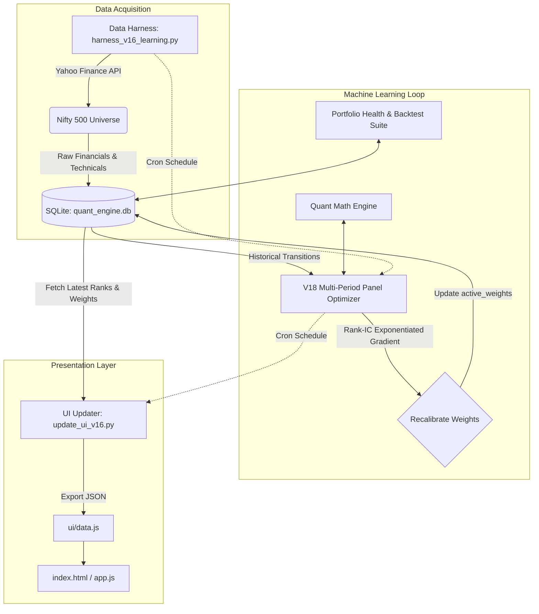

# 🚀 Multi-Bagger Stocks ML Train Loop & Quant UI


A quantitative factor engine that scores, ranks, and tracks Nifty 500 stocks. It pulls fundamental and technical data from Yahoo Finance, scores eight factors, applies value-trap and trend multipliers, and adjusts factor weights from realised forward returns using a bounded exponentiated-gradient step.

> **Status (Sep 2026):** after three monthly holding periods the model's measured edge is dominated by its 50/200-day trend filter; the fundamental composite and the learning loop have not yet shown out-of-sample value beyond noise. See [docs/analysis/red_team_review.md](docs/analysis/red_team_review.md) before quoting any performance figure from this repository.

The output is presented in a modern, glassmorphism-style web dashboard complete with an "AI Factor Breakdown" and raw quantitative metrics.

---

## 🤖 Claude Code & AI Agent Ready
This repository is configured for immediate use with **Claude Code** and other AI agents. See [CLAUDE.md](CLAUDE.md) for architectural invariants, development conventions, database schemas, and CLI workflows.

---

## 🏗️ Architecture

The system is broken down into three distinct layers: **Data Acquisition (Harness)**, **Machine Learning (Optimizer)**, and **Presentation (UI)**.



---

## 🧩 Core Components

### 1. The Data Harness (`harness_v16_learning.py`)
Fetches fundamental and technical data (P/E Ratios, ROCE, FCF Yield, SMA 50/200, Institutional Holdings) for all stocks in the Nifty 500. It rate-throttles requests (0.5s) to protect against API blocks and inserts clean snapshot records into SQLite.

### 2. The Quant Math Engine (`quant_math.py`)
Houses proprietary scoring and valuation algorithms:
- **Growth** (Compound revenue, EBIT, FCF, EPS growth)
- **Quality** (ROCE, FCF conversion ratio)
- **Valuation** (DCF intrinsic value with growth caps, Bank Justified P/B model, Margin of Safety)
- **Risk** (Strategic & disruption risk scoring)
- **Smart Money** (Institutional holding levels and historical delta)
- **Momentum** (Golden Cross vs Death Cross hard-kill protection)

### 3. The ML Optimizer (`weight_optimizer.py`)
Discovers full-universe snapshot dates, evaluates each forward-holding period from prices already in SQLite (excluding suspected unadjusted splits), computes per-factor Spearman Rank ICs with t-statistics, and prints an attribution table separating the fundamental composite from the momentum filter. Each period is learned from exactly once (idempotent); weights stay within `[5.0%, 30.0%]` and sum to exactly 1.000. `--dry-run` shows the step without writing.

### 4. The Quantitative Verification Suite (`eval_portfolio_health.py`)
Verifies bounds, the momentum hard kill, input units (dividend/FCF yields), near-constant factors, `final == base × multipliers`, weight constraints and provenance, then runs the multi-period audit and a strict walk-forward test of the learning rule (weights learned only from earlier periods vs equal weights). Exit code 1 on errors.

### 5. The Presentation Layer (`ui/` & `update_ui_v16.py`)
`update_ui_v16.py` extracts the latest predictions, active weights, data-quality flags, and turnaround screen candidates into `ui/data.js`. The frontend (`index.html`, `app.js`, `style.css`) is vanilla HTML/JS/CSS with no build step (it does load Chart.js and a Google font from CDNs).

---

## 🚀 Getting Started

### Prerequisites
- Python 3.10+
- A modern web browser

### Installation
1. Clone the repository:
   ```bash
   git clone https://github.com/saurabnigam/multi-bagger-stocks-ml-train-loop.git
   cd multi-bagger-stocks-ml-train-loop
   ```
2. Set up virtual environment and install dependencies:
   ```bash
   python3 -m venv venv
   source venv/bin/activate
   pip install -r requirements.txt
   ```

3. Run the complete pipeline (or `./daily_cron.sh`):
   ```bash
   python db_setup.py
   python harness_v16_learning.py
   python weight_optimizer.py
   python update_ui_v16.py
   python eval_portfolio_health.py
   ```
   All paths are relative to the repository; set `QUANT_DB_PATH` to point at another database.

4. View the Dashboard:
   Open `ui/index.html` in your web browser.

---

## 🧪 Testing & Verification
```bash
# Run unit tests (scoring math, optimizer pure functions, red-team regressions)
pytest -q

# Run portfolio health evaluation
python eval_portfolio_health.py
```

---

## ⚙️ Automation (The "Train Loop")

The system is designed to be autonomous. A cron job (`daily_cron.sh`) can be scheduled to run the entire pipeline on market days:
1. **Pull Data:** Collects market closing data.
2. **Train/Optimize:** Evaluates out-of-sample forward returns across historical transitions.
3. **Re-weight:** Adjusts factor weights via continuous gradient ascent.
4. **Publish:** Updates the dashboard data and commits to Git.
