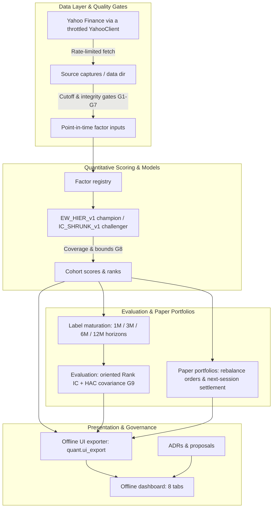

# Multi-Bagger Stocks ML Train Loop & Quant Engine (V2)


A quantitative research platform that scores, ranks, and tracks Indian equities across
the **Nifty 500** universe, built to a written specification
(`docs/spec/MASTER_SPEC.md`, revision 2) with point-in-time (PIT) data discipline,
evidence-based quality gates, and an append-only decision ledger.

> **Status, as of 2026-09-10:**
> - V2 has been implemented and reviewed against the spec. **No live cohort has been
>   published yet, and no out-of-sample performance is claimed.** A first live cutoff
>   requires bootstrap captures (below) and at least one clean monthly run.
> - The historical legacy database (`quant_engine.db`) is migrated read-only as four
>   flagged legacy cohorts (June/July/Aug/Sep 2026) for comparison; it is not a V2
>   scoring input and its own defects (see `docs/analysis/red_team_review.md`) are
>   preserved, not corrected, on migration.
> - **Simulated research & paper trading only.** All scoreboard rankings and portfolio
>   positions are research artifacts and paper simulations. No probability of future
>   profitability is claimed.
> - **Frozen legacy invariant:** `quant_engine.db` is strictly frozen at SHA256
>   `03fe228b8fc90c63e8deddd33d1f9308693972af931aec7000c6870a34cb48a8` and is never
>   written to by any V2 code path.
> - **No automatic pushes:** pipeline execution and automation scripts never push to
>   a remote repository automatically; `monthly_cron.sh` refuses an explicit `--push`.

---

## Architecture

The system enforces strict point-in-time (PIT) information boundaries, evidence-based
pre/post-compute quality gates (G1-G10), HAC-adjusted inferential statistics, paper
portfolio execution, and offline evidence presentation:


```mermaid
graph TD
    subgraph Data Layer & Quality Gates
        V[Yahoo Finance via a throttled YahooClient] -->|Rate-limited fetch| C[Source captures / data dir]
        C -->|Cutoff & integrity gates G1-G7| DI[Point-in-time factor inputs]
    end

    subgraph Quantitative Scoring & Models
        DI --> FR[Factor registry]
        FR --> M[EW_HIER_v1 champion / IC_SHRUNK_v1 challenger]
        M -->|Coverage & bounds G8| S[Cohort scores & ranks]
    end

    subgraph Evaluation & Paper Portfolios
        S --> L[Label maturation: 1M / 3M / 6M / 12M horizons]
        L --> EV[Evaluation: oriented Rank IC + HAC covariance G9]
        S --> P[Paper portfolios: rebalance orders & next-session settlement]
    end

    subgraph Presentation & Governance
        S & EV & P --> EX[Offline UI exporter: quant.ui_export]
        EX --> UI[Offline dashboard: 8 tabs]
        KB[ADRs & proposals] --> UI
    end
```

There is no death-cross multiplier, trap-score multiplier, or momentum multiplier in
V2 scoring, and no exponentiated-gradient optimizer — those are legacy-only facts
about the frozen 2026 snapshots. See `AGENTS.md` for the actual V2 invariants
(integer family-weight units summing to 10000, the EW_HIER/IC_SHRUNK model pair, and
the eligibility screens) and the real journaling/staging architecture.

---

## Core packages (`quant/`)

1. **`quant.universe`**: Nifty 500 constituents, ISINs, corporate actions (splits/bonuses), and symbol transitions.
2. **`quant.data`**: raw captures, observation cutoffs, and quality gates (G1-G7 pre-compute, G8-G10 post-compute).
3. **`quant.factors`**: pure, vectorized factor calculators.
4. **`quant.model`**: EW_HIER_v1 (champion) and IC_SHRUNK_v1 (challenger) family-weight models — integer weight units, no legacy multipliers.
5. **`quant.evaluation`**: forward returns, oriented Rank IC, Newey-West HAC covariance, learning curves, and the leakage audit suite.
6. **`quant.portfolio`**: paper portfolio simulation, order generation, execution settlement, cost models, and benchmark comparisons.
7. **`quant.knowledge`**: Architecture Decision Records (ADRs), proposals, review budget, and human co-sign ratifications (60-day rule).
8. **`quant.migrate`**: read-only, idempotent legacy migration of the four historical 2026 snapshots — never modifies `quant_engine.db`.
9. **`quant.run` & `quant.ui_export`**: monthly orchestration with staged-transaction rollback (`RunContext`) and the zero-dependency offline UI export.

---

## Zero-dependency offline UI

`ui/` has 8 tabs: Ranking, Learning, Scoreboard, Factors, Sectors, Data, Knowledge,
Legacy — each with explicit empty/blocked states rather than a silent absence. All
scripts, styles, and libraries (`ui/vendor/chart.umd.js`) are locally vendored with
system font stacks; there are no external CDN or Google Font requests.

---

## Bootstrapping a real run (MASTER_SPEC §2.2, §3.2, §10.4)

V2 does not backfill a live cutoff from current statements — it requires real
captures taken before that cutoff. The sequence:

```bash
# 1. Initialize the state schema (idempotent; installs the journal triggers)
python3 -m quant db init

# 2. Capture at least once before your intended first cutoff — preferably during
#    the last trading week of the month, and again after the final session closes.
#    This archives constituents, attributes, holdings, statements and price
#    windows at actual capture time. It requires no prior scoring cohort.
python3 -m quant data capture

# 3. In the FOLLOWING month, run the monthly pipeline. It captures fresh
#    observations for the next cutoff, updates price history, and selects only
#    admissible pre-cutoff captures for the target cohort.
./monthly_cron.sh
```

A run without sufficient earlier captures reports `BLOCKED: BOOTSTRAP_REQUIRED` and
publishes no live cohort — this is the expected, honest outcome of running before
bootstrap is complete, not a defect.

---

## Running tests & verification

```bash
# Specification integrity check
python3 docs/spec/check_spec.py

# Full test suite (unit + integration); interpreter resolved as
# $QUANT_PYTHON, else venv/bin/python, else python3
./scripts/check.sh

# Phased sign-off (engineering / operational / longitudinal); see --help for
# --phase, --as-of and --output
./scripts/signoff.sh --help
./scripts/signoff.sh --phase engineering
```

`scripts/signoff.sh` reports real subprocess exit codes and elapsed times, not
fabricated pass strings: engineering checks (S01-S08) run against isolated
fixtures; operational checks (S09-S12) run only with `QUANT_NETWORK=1`,
`QUANT_LEGACY_REAL=1`, or a real state database present, and otherwise report
`DEFERRED` with the missing prerequisite named; longitudinal checks (S13-S14)
report `DEFERRED` until at least 3 live cohorts have matured; S15 is a research
observation that never affects the exit code. See
`docs/spec/TEST_AND_VERIFICATION_PLAN.md` section 8 for the full row table and
`docs/spec/SIGNOFF_2026-09-08.md` for why the original report needed correcting.
