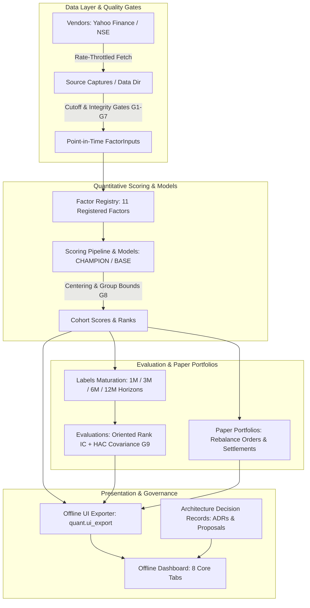

# 🚀 Multi-Bagger Stocks ML Train Loop & Quant Engine (V2 Institutional)


An institutional-grade quantitative machine learning platform that scores, ranks, and tracks Indian equities across the **Nifty 500** universe.

> **Governance & Integrity Notice:** 
> - **Simulated Research & Paper Trading Only:** All return metrics, scoreboard rankings, and portfolio positions are research artifacts and paper simulations. No probability of future profitability is claimed.
> - **Frozen Legacy Invariant:** The historical 2026 database (`quant_engine.db`) is strictly frozen with SHA256 `03fe228b8fc90c63e8deddd33d1f9308693972af931aec7000c6870a34cb48a8` and preserved as an immutable historical record.
> - **No Automatic Pushes:** Pipeline execution and automation scripts never push to remote repositories automatically.

---

## 🏛️ V2 Institutional Architecture

The system is built on a modular package architecture (`quant/`) that enforces strict point-in-time (PIT) information boundaries, pre/post-compute quality gates (G1–G10), HAC-adjusted inferential statistics, paper portfolio execution, and offline evidence presentation:


```mermaid
graph TD
    subgraph Data Layer & Quality Gates
        V[Vendors: Yahoo Finance / NSE] -->|Rate-Throttled Fetch| C[Source Captures / Data Dir]
        C -->|Cutoff & Integrity Gates G1-G7| DI[Point-in-Time FactorInputs]
    end

    subgraph Quantitative Scoring & Models
        DI --> FR[Factor Registry: 11 Registered Factors]
        FR --> M[Scoring Pipeline & Models: CHAMPION / BASE]
        M -->|Centering & Group Bounds G8| S[Cohort Scores & Ranks]
    end

    subgraph Evaluation & Paper Portfolios
        S --> L[Labels Maturation: 1M / 3M / 6M / 12M Horizons]
        L --> EV[Evaluations: Oriented Rank IC + HAC Covariance G9]
        S --> P[Paper Portfolios: Rebalance Orders & Settlements]
    end

    subgraph Presentation & Governance
        S & EV & P --> EX[Offline UI Exporter: quant.ui_export]
        EX --> UI[Offline Dashboard: 8 Core Tabs]
        KB[Architecture Decision Records: ADRs & Proposals] --> UI
    end
```

---

## 🧩 Core Packages (`quant/`)

1. **`quant.universe`**: Nifty 500 constituents, ISINs, corporate actions (splits/bonuses), and symbol transitions.
2. **`quant.data`**: Raw captures, observation cutoffs, and quality gates (G1–G7 pre-compute, G8–G10 post-compute).
3. **`quant.factors`**: Pure vectorized factor calculators (Value, Quality, Growth, Moat, Balance Sheet, Smart Money, Volatility, Momentum).
4. **`quant.model`**: Model definitions, exponentiated gradient updates, active weights bounds `[0.05, 0.30]`, and normalization.
5. **`quant.evaluation`**: Forward returns, oriented Rank IC, Newey-West HAC covariance, learning curves, and leakage audit suite (T1–T10).
6. **`quant.portfolio`**: Paper portfolio simulation, order generation, execution settlement, cost models, and scoreboard benchmark comparisons.
7. **`quant.knowledge`**: Architecture Decision Records (ADRs), proposals, review budget, and human co-sign ratifications (60-day rule).
8. **`quant.migrate`**: Read-only idempotent legacy migration of historical V18 snapshots without modifying the frozen database.
9. **`quant.run` & `quant.ui_export`**: Monthly orchestration pipeline with staged transaction rollbacks and zero-dependency offline UI export.

---

## 🖥️ Zero-Dependency Offline UI

The dashboard in `ui/` features 8 core tabs:
1. **Ranking**: Universe ranking, eligible constituents, factor breakdowns, death-cross alerts, and high-growth turnaround screen.
2. **Learning**: Multi-period out-of-sample learning curves (Chart.js) and evaluation metrics table with mandatory uncertainty status (`estimable`, `unavailable`).
3. **Scoreboard**: Simulated paper portfolios, benchmark comparisons, and pending rebalance orders for next session execution.
4. **Factors**: Factor registry, mathematical formulas, and input data coverage contracts.
5. **Sectors**: Macro sector groupings and peer-group neutralization diagnostics.
6. **Data**: Point-in-time observation cutoffs, capture manifests, and G1–G10 quality gate audits.
7. **Knowledge**: Architecture Decision Records (ADRs), proposals, and governance lifecycle status.
8. **Legacy**: Historical 2026 legacy snapshots (June 14, July 11, Aug 14, Sep 03) and attribution reconciliation.

> **Zero External Requests:** All frontend scripts, styles, and libraries (`ui/vendor/chart.umd.js`) are locally vendored with system font stacks. No external CDN or Google Font requests are made.

---

## 🚀 Quick Start & CLI

### Installation
```bash
python3 -m venv venv
source venv/bin/activate
pip install -r requirements.txt
```

### Running Tests & Verification
```bash
# Run specification integrity check
python3 docs/spec/check_spec.py

# Run complete test suite (unit + integration)
./scripts/check.sh

# Run phased sign-off (Engineering / Operational / Longitudinal)
./scripts/signoff.sh
```

### Running the Monthly Pipeline
```bash
# Monthly orchestration (capture, mature, score, evaluate, paper settle, export)
./monthly_cron.sh
```
