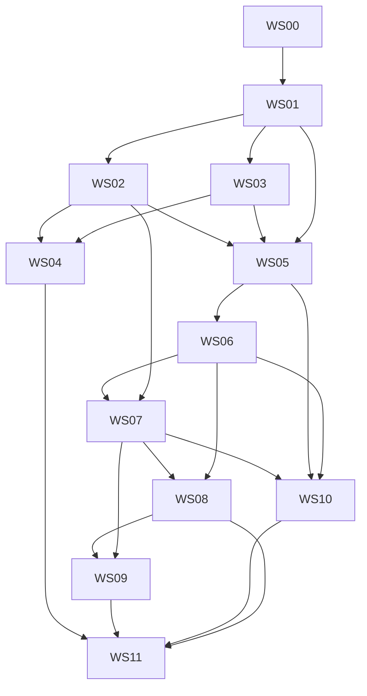

# Subagent Workstreams — Index and Rules of Engagement

This folder splits `docs/spec/MASTER_SPEC.md` into twelve workstreams. Each `WSxx_*.md` is written so that a coding agent can implement that workstream from the doc plus the master spec alone. `_workstreams.json` is the machine-readable plan. `PROGRESS.md` is the running log every implementer appends to.

## Read in this order

1. `docs/spec/00_context_brief.md` — what the owner wants and what exists (10 minutes)
2. `docs/spec/MASTER_SPEC.md` — the contract (read fully once; then by section)
3. this file — build order, interfaces, rules
4. the workstream doc you are implementing
5. `docs/spec/TEST_AND_VERIFICATION_PLAN.md` — how the whole thing is proven

## Workstreams and build order

```
id    name                                                        depends on                      spec sections
WS00  Foundations: package, config, schema, ledger, calendar,     —                               10.1–10.4, 4.2, 2.4
      run context, test harness
WS01  Universe, ISIN identity, sector taxonomy & groups           WS00                            3.1–3.4
WS02  Prices, corporate actions, TRI, monthly panel, benchmarks   WS00, WS01                      4.3, 4.5, 7.4, 8.2
WS03  Yahoo client, units, bitemporal fundamentals, holdings      WS00, WS01                      4.4, 10.6
WS04  Field contracts, drift, run gates, DQ events                WS01, WS02, WS03                4.6, 10.6
WS05  Factor library: contract, inputs, standardise, registry,    WS01, WS02, WS03                5, 3.5
      launch factors, sector features
WS06  Composite, screens, models, champion/challenger, learning   WS05                            6
WS07  Labels, statistics, walk-forward, evaluations, leakage,     WS02, WS05, WS06                2, 7
      curves
WS10  Legacy migration                                            WS01, WS02, WS03, WS05, WS06, WS07   10.7, 4.5
WS08  Paper portfolios, costs, scoreboard                         WS06, WS07                      8
WS09  Knowledge base, criteria engine, proposals, approvals,      WS06, WS07, WS08                9, 5.4, 5.5
      ADRs, monthly report
WS11  Orchestrator, backfill replay, UI, cron, docs, sign-off     all                             9.1, 10.3, 10.5, 10.8, 11
```

Build strictly in the order `WS00 → WS01 → WS02 → WS03 → WS04 → WS05 → WS06 → WS07 → WS10 → WS08 → WS09 → WS11`. WS02 and WS03 may be built in parallel by two agents after WS01; WS08 and WS09 may be built in parallel after WS07; nothing else overlaps. WS10 comes before WS08/WS09 so that the legacy points exist when the report and scoreboard are first rendered.



## Cross-workstream interface contracts (provider → consumers)

Signatures are the contract; bodies are the implementer's. Exact DDL is in MASTER_SPEC and `quant/db/schema.sql` (owned by WS00; nobody else edits DDL — request a change through PROGRESS.md and WS00's owner applies it).

```
WS00 → all
  quant.config.load(path: str|None = None) -> Config            attribute access mirroring config/quant.toml; Config.paths.db etc.; REPO_DIR
  quant.db.core.connect(path: str|None = None) -> sqlite3.Connection    Row factory, WAL, foreign_keys ON
  quant.db.core.apply_schema(conn) -> None                        idempotent; records schema_version
  quant.db.core.upsert(conn, table: str, df: pd.DataFrame, keys: list[str]) -> int
  quant.db.core.replace_as_of(conn, table: str, as_of: str, df: pd.DataFrame, track: str = 'live') -> int
  quant.db.ledger.export(conn, as_of: str) -> list[Path] ; rebuild(ledger_dir, db_path) -> None ; verify(conn, ledger_dir) -> VerifyReport ; size() -> dict
  quant.data.calendar.trading_days(conn|store) -> pd.DatetimeIndex ; last_trading_day_on_or_before(d: str) -> str ; month_ends(start, end) -> list[str] ; add_trading_days(d, n) -> str
  quant.run.RunContext(as_of: str, kind: str, track: str = 'live', cfg=None)   context manager: inserts runs row, exposes .run_id, .conn, .cfg, .git_sha; sets status/finished_at on exit
  quant.errors: Blocked, Refused, LookaheadError, AlreadyMigrated
  quant.cli.register(group: str, name: str, fn: Callable, help: str)   subcommand registry used by every workstream
  tests.synthetic.make_world(tmp_path, n_securities=60, n_groups=6, months=48, seed=0) -> World   (db_path, prices_db_path, planted signal spec, split/dividend/reclass events)

WS01 → WS02, WS03, WS04, WS05, WS07, WS10, WS11
  quant.data.universe.fetch_list(name: str, as_of: str, cfg) -> Path ; parse_list(path) -> pd.DataFrame[isin, symbol, company_name, nse_sector, series]
  quant.data.universe.snapshot(conn, as_of: str, cfg) -> UniverseSnapshot(n_rows, sha256, new_isins, dropped_isins, reclassified)
  quant.data.universe.members_at(conn, as_of: str, index_name: str = 'NIFTY500') -> pd.DataFrame[security_id, isin, symbol, nse_sector, series]
  quant.data.identity.resolve_security_id(conn, isin=None, symbol=None, as_of=None) -> int|None ; yahoo_ticker(conn, security_id, as_of) -> str
  quant.data.identity.tracked_securities(conn, as_of: str) -> list[int]      current members + securities inside an open label window
  quant.sectors.taxonomy.update_sector_map(conn, as_of: str, cfg) -> SectorUpdate(n_new, n_reclassified, groups: pd.DataFrame)
  quant.sectors.taxonomy.sector_group_at(conn, as_of: str) -> pd.Series[security_id -> sector_group] ; group_table(conn, as_of) -> pd.DataFrame[sector_group, n, merged_from]
  quant.sectors.crosswalk.yahoo_to_nse(yahoo_sector: str, yahoo_industry: str|None) -> tuple[str, float]

WS02 → WS05, WS07, WS08, WS10, WS11
  quant.data.prices.PriceStore(path)   .backfill(tickers: dict[int, str], start: str, cfg) ; .update(security_ids, as_of, cfg) -> UpdateReport ; .reconcile_overlap(...) -> list[Event]
      .close_raw(security_ids, start, end) -> pd.DataFrame[date x security_id] ; .tri(...) ; .volume(...) ; .adv_inr(security_ids, as_of, window=63) -> pd.Series
      .manifest_write() -> Path ; .manifest_verify() -> list[str]
  quant.data.prices.build_monthly_panel(conn, store, as_of: str) -> pd.DataFrame     (prices_monthly rows; writes them)
  quant.data.actions.detect_unrecorded(store, security_ids, since: str, log_threshold: float) -> list[Event] ; add_ca(conn, store, isin, ex_date, kind, factor, decision_id) ; clear_flag(conn, isin, date, by)
  quant.data.benchmarks.update(conn, store, as_of: str, cfg) -> None ; series(conn, benchmark_id: str, start, end) -> pd.Series ; ew_tri(store, security_ids, dates) -> pd.Series

WS03 → WS04, WS05, WS10, WS11
  quant.data.yahoo.YahooClient(cfg)   .download_batch(tickers: list[str], start, end) -> pd.DataFrame ; .bundle(ticker: str) -> RawBundle ; .archive(as_of, bundles) -> Path
  quant.data.yahoo.norm_dividend_yield(rate, close) -> float ; norm_debt_to_equity(x) -> float ; norm_fraction(x) -> float ; to_nan(x) -> float
  quant.data.fundamentals.ingest(conn, client, security_ids, as_of: str, cfg, statements: bool) -> IngestReport
  quant.data.fundamentals.available_from(period_end: str, freq: str, earnings_dates: pd.DataFrame|None) -> tuple[str, str]
  quant.data.fundamentals.pit_frame(conn, as_of, statement, field, freq, n_periods, security_ids) -> pd.DataFrame[security_id x period_rank]
  quant.data.fundamentals.ttm(conn, as_of, field, security_ids) -> tuple[pd.Series, pd.Series]   (values, flags)
  quant.data.holdings.capture(conn, bundles, as_of) -> int ; series(conn, as_of, lag_runs: int, security_ids) -> pd.Series
  quant.data.attributes.capture(conn, bundles, as_of) -> int ; at(conn, as_of, field: str, security_ids) -> pd.Series

WS04 → WS11 (and everyone records events)
  quant.data.gates.run(conn, store, as_of: str, cfg) -> GateReport(passed: bool, dq_status: str, rows: pd.DataFrame)   raises Blocked when a blocking gate fails
  quant.data.gates.record_event(conn, run_id, as_of, severity, code, security_id=None, field=None, detail=None) -> int
  quant.data.contracts.load(cfg) -> dict ; check_field(values: pd.Series, contract: dict) -> ContractResult ; psi(a: pd.Series, b: pd.Series) -> float

WS05 → WS06, WS07, WS10, WS11
  quant.factors.base.FactorSpec, Factor, FactorInputs                     exactly as MASTER_SPEC 5.1
  quant.factors.inputs.build(conn, store, as_of: str, cfg, track: str = 'live') -> FactorInputs
  quant.factors.standardise.standardise(raw: pd.Series, groups: pd.Series, spec: FactorSpec, cfg) -> pd.DataFrame[raw, winsor, z, flags]
  quant.factors.registry.REGISTRY: dict[str, Factor] ; sync(conn) -> SyncReport ; statuses(conn) -> dict[factor_id, str]
  quant.factors.registry.compute_all(conn, store, as_of, cfg, track='live') -> ComputeReport ; compute_one(conn, store, as_of, factor_id, cfg, track) ; test_factor(name) -> TestReport
  quant.factors.registry.values_frame(conn, as_of: str, factor_ids: list[str], track: str) -> pd.DataFrame[security_id x factor_id] (z) + flags
  quant.factors.sector.compute_features(conn, store, as_of, cfg) -> pd.DataFrame  (writes sector_features)

WS06 → WS07, WS08, WS09, WS10, WS11
  quant.model.learn.fit_family_weights(ic_hist: pd.DataFrame, horizon_m=3, k_shrink=24.0, floor_mult=0.5, cap_mult=2.0, min_n_eff=4.0) -> tuple[dict, dict]
  quant.model.composite.compose(z: pd.DataFrame, families: dict[str, str], weights: dict[str, float], groups: pd.Series, cfg, sleeve: pd.Series|None = None) -> pd.DataFrame
  quant.model.screens.apply(conn, as_of: str, df: pd.DataFrame, cfg) -> pd.DataFrame[eligible, exclusion_reason, liquidity_bucket]
  quant.model.models.score_all(conn, store, as_of: str, cfg, track='live') -> ScoreReport ; score_one(conn, store, as_of, model_id, cfg, track)
  quant.model.models.definition_at(conn, model_id: str, as_of: str) -> ModelVersion ; bump_version(conn, model_id, factor_set, weights, decision_id, valid_from) -> int
  quant.model.models.check_invariants(conn) -> list[str] ; review(conn, as_of) -> ReviewReport (P1–P5 per challenger) ; ic_history(conn, model_id, horizon, through) -> pd.DataFrame

WS07 → WS06 (reads), WS08, WS09, WS10, WS11
  quant.evaluation.labels.mature(conn, store, as_of: str, cfg) -> LabelReport ; frame(conn, as_of, horizon_m, scope='eligible', track='live') -> pd.DataFrame
  quant.evaluation.stats.hac_mean_test(x: np.ndarray, lag: int) -> HacResult(mean, se, t, ci_lo, ci_hi, n, n_eff) ; block_bootstrap_ci(x, block, n=1000, q=0.90) ; t_crit(m: int) -> float ; wilson(k, n, z=1.645)
  quant.evaluation.metrics.rank_ic(score, label) -> float ; quintiles_within_group(score, label, groups) -> pd.DataFrame ; partial_ic(...) ; corr_matrix(...) ; fm_slope(...)
  quant.evaluation.walkforward.labels_available(conn, T: str, h: int, track='live') -> list[str] ; replay_backfill(conn, store, cfg, start, end) -> None
  quant.evaluation.leakage.run_all(conn, store, as_of, cfg) -> LeakageReport ; t1_shuffle(...) ... t10_sector(...)
  quant.evaluation.evaluate.run(conn, store, as_of: str, cfg, track='live') -> EvalReport ; ic_series(conn, subject_kind, subject_id, horizon_m, scope, track, through) -> pd.Series
  quant.evaluation.curves.update(conn, as_of, cfg) -> None ; random_composite_percentile(conn, as_of, cfg) -> float
  quant.evaluation.labels.multibagger(conn, as_of, model_id) -> dict

WS08 → WS09, WS11
  quant.portfolio.costs.bucket(adv_inr: float, cfg) -> str ; cost_bps_one_way(bucket: str, cfg, stress=False) -> float
  quant.portfolio.construct.rebalance(prev: pd.DataFrame, ranks: pd.Series, eligible: pd.Series, groups: pd.Series, cfg) -> tuple[pd.DataFrame, pd.DataFrame]
  quant.portfolio.paper.rebalance_all(conn, store, as_of: str, cfg) -> PaperReport ; returns(conn, portfolio_id, start, end) -> pd.DataFrame
  quant.portfolio.scoreboard.compute(conn, as_of: str, cfg) -> pd.DataFrame ; verdict(ir, t, n_months) -> str ; years_to_significance(ir) -> float

WS09 → WS11
  quant.knowledge.registry.new_hypothesis(conn, cfg, **fields) -> str (raises Refused on budget) ; budget_status(conn, year) -> dict ; export_jsonl(conn, knowledge_dir)
  quant.knowledge.review.criteria_for_factor(conn, factor_id, as_of, cfg) -> CriteriaCheck ; criteria_for_model(conn, model_id, as_of, cfg) -> CriteriaCheck
  quant.knowledge.proposals.draft(conn, as_of, cfg) -> list[str] ; approve(conn, proposal_id, by: str, note: str, cfg) -> str ; reject(...) ; apply(conn, as_of, cfg) -> AppliedReport ; tier_of(kind) -> int
  quant.knowledge.adr.write(conn, decision_id) -> Path ; check_all_have_adr(conn) -> list[str]
  quant.knowledge.report.render(conn, as_of, cfg) -> Path ; alpha_word_allowed(n_months, t) -> bool
  quant.knowledge.lessons.add(conn, text, refs=None, decision_id=None) -> int

WS10 → WS11
  quant.migrate.legacy.run(conn, legacy_db_path: str, store, cfg, dry_run=False) -> MigrationReport   raises AlreadyMigrated on a second call

WS11
  quant.run.monthly(as_of: str, cfg, skip_fundamentals=False, stop_after=None, override=None, push=False, dry_run=False, force=False) -> int (exit code)
  quant.ui_export.export(conn, cfg) -> list[Path]
```

## Rules of engagement

1. **MASTER_SPEC wins.** If a workstream doc, a test or your judgement disagrees with `docs/spec/MASTER_SPEC.md`, implement the spec and log the disagreement in `subagents/PROGRESS.md` under "Deviations". Section 15 of the spec lists the open questions and the default to take for each; take the default and log it.
2. **Never skip a verification checklist.** Each doc's section 10 is the definition of "done"; run every command and paste the output into PROGRESS.md.
3. **Tests before or with code.** Every function in the interface table has at least one test. `pytest -q` must be green before you commit. Network tests are opt-in.
4. **No performance claims.** Never write a number into a doc, report or UI that was not produced by `quant evaluate` with its `n_eff` and band. "Target" is the only permitted framing for expectations.
5. **No schema edits outside WS00.** Need a column? Write the request in PROGRESS.md; WS00's owner (or you, wearing that hat, in a separate commit touching only `quant/db/schema.sql` and its test) applies it.
6. **Point-in-time is enforced in code, not in review.** Anything a factor reads passes through `FactorInputs`; the truncation test (T3) must be written in WS05, not last.
7. **Never impute.** NaN plus a flag. The +15% growth default and None→0 ROE were the legacy engine's most damaging bugs.
8. **Commit per workstream** with message `WSxx: <summary>`; append the PROGRESS.md section in the same commit. Do not push unless the owner's handoff says so.
9. **Stop and ask only** when you hit a decision not covered by MASTER_SPEC section 15 defaults, or when a gate on real data blocks and the fix would change what is stored about the past.
10. **The legacy code is not modified** (`harness_v16_learning.py`, `weight_optimizer.py`, `quant_math.py`, `eval_portfolio_health.py`, `update_ui_v16.py`, `db_setup.py`, `config.py`, `test_quant_math.py`, `test_optimizer.py`) until WS11 moves them to `legacy/` unchanged. Their 58 tests keep passing throughout. `quant_engine.db` is opened read-only by everyone.

## Progress protocol (`subagents/PROGRESS.md`)

Append, never rewrite:

```
## WSxx <name> — <date> — <agent/model>
Built: <files, one line each>
Tests: `<command>` -> <N passed in S s>
Verification checklist: <each item: command -> observed output (abridged)>
Deviations from MASTER_SPEC: <none | list with reason>
Open questions taken as default: <Qn -> default>
Handoff notes for downstream: <what they can rely on, known limitations>
Commit: <sha>
```
